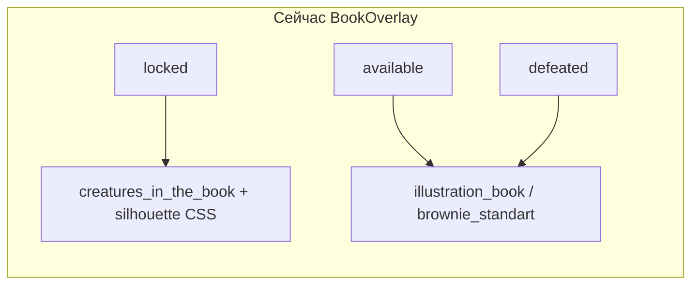
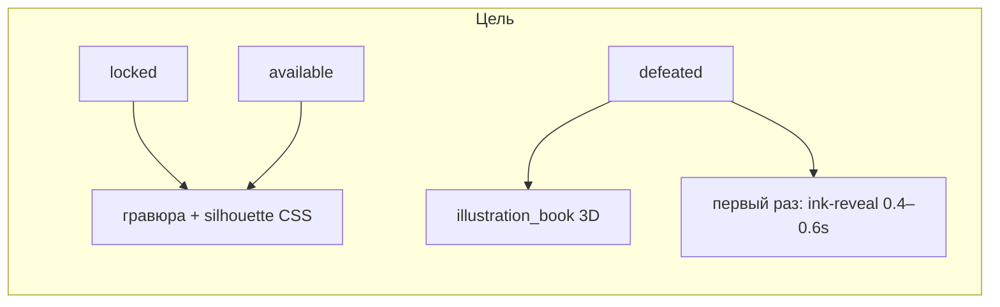

# План: 3D-иллюстрации на правой странице книги

## Текущее состояние



- Логика в [`src/ui/book/BookOverlay.tsx`](src/ui/book/BookOverlay.tsx): `spiritIllustrationUrl(spiritId, locked)` — цветная картинка для **всех не-locked** статусов.
- Реестр: [`src/config/assetRegistry.ts`](src/config/assetRegistry.ts) — `spiritIllustrationPaths` (15 духов + Домовой на `brownie_standart.png`).
- CSS: [`.book-illustration`](src/ui/index.css) — `max-height: 58%`, `object-fit: contain`; силуэт только при `.book-page--silhouette`.
- Ассеты: в [`assets/illustration_book/`](assets/illustration_book/) лежат **старые** PNG (часть — по сути гравюра/не диорама); **новые черновики** — 16 файлов в [`instruction/design/drafts/*_illustration_draft.png`](instruction/design/drafts/).
- Канон анимации: [`instruction/scenario.md`](instruction/scenario.md) §5.2 п.3 — чернильное появление при **первом** открытии после победы; [`instruction/book_layout.md`](instruction/book_layout.md) §4 — сейчас пишет `available` = полная иллюстрация (**устарело**, согласовано: до победы = силуэт).

## Целевое поведение



| Статус | Правая страница | Источник |
|--------|-----------------|----------|
| `locked` | Затемнённый силуэт | `creatures_in_the_book/` |
| `available` | **Тот же силуэт** (выбор Ильи) | `creatures_in_the_book/` |
| `defeated` | Цветная 3D-диорама | `illustration_book/` |

---

## Фаза 1 — Ассеты (production)

**Вход:** черновики из `instruction/design/drafts/`.

**Маппинг draft → файл в `assets/illustration_book/`** (по [`instruction/assets_catalog.md`](instruction/assets_catalog.md)):

| spiritId | Целевой файл |
|----------|--------------|
| brownie | `brownie.png` |
| susedko | `susedko.png` |
| bannik | `bannik.png` |
| kikimora | `kikimora.png` |
| poludnik | `poludnik.png` |
| ovinnik | `ovinnik.png` |
| leshiy | `leschii.png` |
| vodyanoy | `waterman.png` |
| dedushka_toptygin | `Grandpa_Toptygin.png` |
| poludnica | `poludnica.png` |
| rusalka | `rusalka.png` |
| lada | `lada.png` |
| veles | `veles.png` |
| baba_yaga | `Baba_Yaga.png` |
| koschei_immortal | `koschei.png` |
| chudo_yudo | `chudo_yodo.png` |

**Постобработка (P0):** вырезать α с чёрного фона (`design_assets_prompts.md` § P0) — иначе на пергаменте будет чёрный прямоугольник.

**Приёмка:** визуально сверить 2–3 духа (Домовой, Кощей, один из леса) в книге на mockup v2 — `object-fit: contain`, центр правой страницы, не stretch.

---

## Фаза 2 — Код: какая картинка когда

### 2.1 `spiritIllustrationUrl` → по статусу

В [`BookOverlay.tsx`](src/ui/book/BookOverlay.tsx) заменить сигнатуру:

```ts
function spiritIllustrationUrl(spiritId: SpiritId, status: SpiritStatus): string {
  if (status !== 'defeated') return spiritPortraitPaths[spiritId];
  return spiritIllustrationPaths[spiritId] ?? spiritPortraitPaths[spiritId];
}
```

### 2.2 Класс силуэта

Сейчас: `status === 'locked'`. Нужно: `status !== 'defeated'`.

```tsx
className={`book-page book-page--right${status !== 'defeated' ? ' book-page--silhouette' : ''}`}
```

### 2.3 `assetRegistry.ts`

- `brownie`: переключить с `brownie/common/brownie_standart.png` на `illustration_book/brownie.png`.
- Убедиться, что все 16 `spiritIllustrationPaths` указывают на `illustration_book/` (не `creatures_in_the_book/`).

---

## Фаза 3 — Анимация «появляется после победы»

Канон: первое открытии страницы **после** перехода в `defeated`.

### 3.1 Persist

Добавить в [`GameSave`](src/domain/GameSave.ts):

```ts
illustrationRevealed: string[]; // spiritId, для которых ink-reveal уже проигран
```

- Дефолт: `[]` в `createDefaultSave` + миграция `hydrate` (пустой массив для старых сейвов).
- После окончания анимации (или skip при `prefers-reduced-motion`) — `gameStore.markIllustrationRevealed(spiritId)` → persist.

### 3.2 UI

В `BookOverlay` на правой странице при `status === 'defeated'`:

- Если `spiritId` **не** в `illustrationRevealed` → класс `.book-illustration--revealing` (CSS keyframes: opacity/clip-path «чернила → картинка», ~0.5s).
- Если уже в массиве → обычный показ.
- `prefers-reduced-motion: reduce` → сразу полная картинка + сразу mark revealed.

Опционально триггер: при возврате из викторины с победой книга уже открыта на этой странице — анимация стартует при mount/смене `spiritId`.

---

## Фаза 4 — CSS под 3D-диорамы

В [`src/ui/index.css`](src/ui/index.css) (блок Epic 10):

- Сохранить эталон: `.book-illustration { max-height: 58%; object-fit: contain; }` — не менять на `fill`.
- Добавить `.book-illustration--revealing` + `@keyframes book-illustration-reveal`.
- При необходимости лёгкий `filter: drop-shadow(...)` только для `defeated` (объём диорамы на пергаменте) — без `width: 100%` stretch.

---

## Фаза 5 — Тесты и документация

| Файл | Что добавить |
|------|----------------|
| Новый `src/ui/book/spiritIllustrationUrl.test.ts` (или domain) | `locked`/`available` → portrait; `defeated` → illustration_book |
| [`bookLayoutCss.test.ts`](src/config/bookLayoutCss.test.ts) | без изменений контракта CSS; опционально тест на наличие reveal keyframes |
| `GameStore.test.ts` | `markIllustrationRevealed` + persist |
| [`instruction/book_layout.md`](instruction/book_layout.md) §4 | `available` = силуэт; `defeated` = 3D + ink-reveal |
| [`instruction/dev/tasks.md`](instruction/dev/tasks.md) | новая TASK с критериями приёмки |

**Критерии приёмки (для TASK):**

- [ ] До победы (`locked` / `available`): правая страница — затемнённая гравюра, **нет** цветной 3D.
- [ ] После победы (`defeated`): цветная диорама из `illustration_book/`.
- [ ] Первое открытие после победы: ink-reveal ~0.5s; повторное — без анимации.
- [ ] Все 16 духов: путь в `spiritIllustrationPaths` ≠ `creatures_in_the_book/`.
- [ ] Домовой: `illustration_book/brownie.png`, не `brownie_standart`.
- [ ] Visual: иллюстрация по центру правой страницы, `contain`, как mockup v2.

---

## Порядок работ (рекомендуемый)

1. Приёмка ассетов (α) → копирование в `assets/illustration_book/`
2. Логика URL + силуэт (`BookOverlay` + `assetRegistry`)
3. `illustrationRevealed` + ink-reveal CSS
4. Тесты + обновление `book_layout.md`
5. Visual check в dev: Домовой до/после квеста, Суседко available vs defeated

## Риски

- **Старые PNG в `illustration_book/`** — заменить целиком; иначе часть духов останется «гравюрой в цвете».
- **Чёрный фон без α** — визуальный баг на пергаменте; блокер перед merge в `assets/`.
- **Сейвы с уже побеждёнными духами** — при первом запуске после патча ink-reveal проиграется один раз (ожидаемо) или можно при миграции проставить все defeated в `illustrationRevealed` (решение при реализации: default `[]` = «показать reveal один раз» для лояльных игроков).
