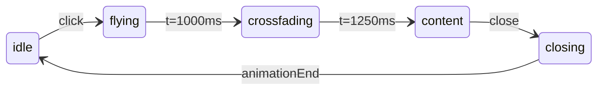

# План: анимация и разворот книги бестиария

## Текущее состояние

| Что есть | Проблема |
|----------|----------|
| [`BookModal.tsx`](src/ui/book/BookModal.tsx) — полный контент разворота | Мгновенный popup, тёмная карточка `.book-modal__inner` |
| [`bookUiStore.ts`](src/store/bookUiStore.ts) — `isOpen`, `pageIndex`, `isFlipping` | Нет фаз анимации; `isFlipping` не используется |
| [`IzbaSceneLayers.tsx`](src/ui/scene/IzbaSceneLayers.tsx) — клик → `bookUiStore.open()` | Нет передачи rect книги, нет блокировки повторного клика |
| [`assetRegistry.ts`](src/config/assetRegistry.ts) — только `bookClosed` | Нет `bookOpen` |
| [`index.css`](src/ui/index.css) §`.scene-book` | Только idle opacity-pulse; modal-стили под generic card |
| Pan-блокировка в [`useOnboardingBootstrap.ts`](src/ui/onboarding/useOnboardingBootstrap.ts) | Только `bookUiStore.isOpen`, не покрывает фазу полёта |

**Канон:** [`instruction/book_layout.md`](instruction/book_layout.md) v1.1 + mockup [`instruction/design/book_bestiary_mockup_landscape.png`](instruction/design/book_bestiary_mockup_landscape.png)



---

## Фаза 0 — Подготовка ассетов

- Убедиться, что `assets/furniture/book_of_spirits_open.png` лежит в репозитории (сейчас в коде отсутствует, в `assetRegistry` нет пути).
- Добавить в [`assetRegistry.ts`](src/config/assetRegistry.ts):
  ```ts
  bookOpen: fromAssets('furniture/book_of_spirits_open.png'),
  ```
- Обновить [`instruction/assets_catalog.md`](instruction/assets_catalog.md): статус `book_of_spirits_open.png` → ✅.

### 0.1 UI-кнопки бестиария — ассеты и промпты

Реестр промптов: [`instruction/design_assets_prompts.md`](instruction/design_assets_prompts.md).  
При реализации — добавить недостающие строки в реестр и пути в [`assetRegistry.ts`](src/config/assetRegistry.ts) (`ui` namespace).

| UI-элемент | Путь ассета | Приоритет | Промпт |
|------------|-------------|-----------|--------|
| Стрелка влево | `assets/ui/arrow_left_wood.png` | **P0** | ✅ уже в реестре §`arrow_left_wood` |
| Стрелка вправо | `assets/ui/arrow_right_wood.png` | **P0** | ✅ уже в реестре §`arrow_right_wood` |
| Кнопка «В путь» | `assets/ui/book_quest_btn_wood.png` | **P0** | ⏳ добавить (см. ниже) |
| Лапка у квеста | `assets/ui/icon_paw.png` | **P0** | ⏳ добавить (см. ниже) |
| Закрыть × | `assets/ui/book_close_wood.png` | **P0** | ⏳ добавить (см. ниже) |
| Закладка «Следующий квест» | `assets/ui/book_bookmark_green.png` | **P1** | ⏳ добавить (см. ниже) |
| Бейдж грейда common/rare/epic/epoch | `assets/ui/badge_grade_*.png` | **P1** | ✅ уже в реестре §`badge_grade_*` |

**MVP-fallback (если PNG ещё нет):** CSS-плашки в стиле `quiz_answer_wood` / unicode ← → — только до появления ассетов; не оставлять как финал.

#### Промпт: `assets/ui/book_quest_btn_wood.png` (P0)

```
game UI quest action button plank horizontal, carved warm honey-toned wood texture,
stylized 3D clay wood tactile, soft beveled edges, matte finish,
empty center area for text overlay, left side reserved for small icon slot,
Slavic folk subtle carved ornament on border, readable at 44px height touch target,
isolated black background, no text baked in,
style reference: assets/ui/quiz_answer_wood.png + assets/furniture/book_of_spirits.png gold trim accent
--no vector icon, flat design, material design, neon, glassmorphism, text in image
```

#### Промпт: `assets/ui/icon_paw.png` (P0)

```
small cat paw print icon, stylized 3D clay plasticine, warm terracotta beige,
matte tactile, cozy casual game HUD icon, isolated black background, no text,
style reference: assets/pets/common/cat_standart/cat_standart_sid.png paw tone
--no vector icon, flat, emoji, photorealistic, line art
```

#### Промпт: `assets/ui/book_close_wood.png` (P0)

```
game UI close button small square, carved dark honey wood with carved X mark,
stylized 3D tactile matte, leather corner accent optional subtle,
fits on book leather cover corner, 36-44px readable touch size,
isolated black background, no text,
style reference: assets/furniture/book_of_spirits.png dark leather + assets/house/hut_standart.png wood
--no vector X icon, flat material, thin line icon, neon, glassmorphism
```

#### Промпт: `assets/ui/book_bookmark_green.png` (P1)

```
book bookmark ribbon tab hanging from top edge, green braided cord fabric texture,
Slavic folk woven green ornament matching book_of_spirits green border,
stylized 3D tactile cloth matte, vertical ribbon with pointed bottom,
empty area for text overlay, isolated black background, no text baked in,
style reference: assets/furniture/book_of_spirits.png green braided border + assets/furniture/book_of_spirits_open.png
--no vector flat ribbon, neon green, generic bookmark icon, text in image
```

#### Промпты стрелок (уже в реестре — для справки)

`arrow_left_wood.png` / `arrow_right_wood.png`:

```
game UI wood arrow button pointing [left|right], carved honey brown clay wood texture,
stylized 3D tactile, matte, cozy casual game navigation,
isolated black background, no text baked in,
style reference: assets/furniture/bench.png
--no vector chevron, flat, material design, thin line icon
```

**Подключение в коде (фаза 4):**

```ts
// assetRegistry.ts
export const bookUi = {
  arrowLeft: fromAssets('ui/arrow_left_wood.png'),
  arrowRight: fromAssets('ui/arrow_right_wood.png'),
  questBtn: fromAssets('ui/book_quest_btn_wood.png'),
  closeBtn: fromAssets('ui/book_close_wood.png'),
  bookmark: fromAssets('ui/book_bookmark_green.png'),
  pawIcon: fromAssets('ui/icon_paw.png'),
} as const;
```

Стрелки: `` внутри `.book-nav`, min 48×48px. «В путь»: nine-slice или `background-image` на `.book-page__quest-btn` + текст поверх. Лапка: `` вместо emoji 🐾.

---

## Фаза 1 — Hover на закрытой книге (CSS)

**Файл:** [`index.css`](src/ui/index.css)

- Hover только на интерактивной книге: `.scene-book.scene-sprite--interactive:hover .scene-sprite__img`
- Эффекты по спеке §1.1: `scale(1.04)`, `translateY(-3px)`, золотой `drop-shadow` pulse 1.6s
- При hover — приостановить idle opacity-pulse (`.scene-book:hover { animation: none }` на img через отдельный класс)
- `@media (prefers-reduced-motion: reduce)` — только opacity-pulse, без scale/glow
- Не добавлять `width`/`height` на `.scene-book` (правило `css-styling.mdc`)

**Файл:** [`IzbaSceneLayers.tsx`](src/ui/scene/IzbaSceneLayers.tsx) — при `bookAllowed` добавить класс `scene-book--interactive` (или использовать уже имеющийся `scene-sprite--interactive`).

---

## Фаза 2 — State machine анимации в store

**Файл:** [`bookUiStore.ts`](src/store/bookUiStore.ts)

Расширить store:

```ts
type BookPhase = 'idle' | 'flying' | 'crossfading' | 'content' | 'closing';

// Новые поля:
phase: BookPhase
flightFrom: DOMRect | null   // rect книги на сцене при клике
showPageContent: boolean      // true после t=1250ms
coverVariant: 'closed' | 'open'
```

**Методы:**
- `startOpen(spiritId, fromRect)` — phase=`flying`, сохранить rect, запустить таймеры (1000ms → crossfade, 1250ms → content)
- `close()` — phase=`closing`, обратная цепочка ≤500ms, затем `idle`
- Геттер `isOverlayActive` = phase !== `'idle'`
- Геттер `isInteractionBlocked` = phase не `'content'`

Таймеры — `window.setTimeout` с очисткой в `close()` / `reset()`. Для `prefers-reduced-motion` — сразу `phase='content'`, `coverVariant='open'`.

**Тесты:** новый файл `src/store/bookUiStore.test.ts` — переходы фаз, сброс при close, reduced-motion shortcut.

---

## Фаза 3 — Анимация открытия (полёт closed → open)

### 3.1 Триггер клика

**Файл:** [`IzbaSceneLayers.tsx`](src/ui/scene/IzbaSceneLayers.tsx)

- `useRef` на обёртку `.scene-book`
- `handleBookClick`: если `bookUiStore.isOverlayActive` — return
- `getBoundingClientRect()` → `bookUiStore.startOpen(target, rect)`
- Убрать прямой вызов `bookUiStore.open()` — его заменяет `startOpen`

### 3.2 Компонент полёта

**Новый файл:** `src/ui/book/BookOverlay.tsx` (или рефактор `BookModal`)

Структура DOM по спеке §2.4:

```html
<div class="book-modal layer-modal" data-phase="flying|content|closing">
  <div class="book-flight">          <!-- closed sprite, FLIP transform -->
    
  </div>
  <div class="book-modal__stage">    <!-- виден после crossfade -->
    
    <!-- контент страниц -->
  </div>
</div>
```

**FLIP-логика** (единственное допустимое inline `style` — runtime transform):
- На mount: вычислить `translate/scale` из `flightFrom` rect → центр viewport / целевой размер `.book-modal__stage`
- CSS transition 0.5s `cubic-bezier(0.22, 1, 0.36, 1)`
- t=1000ms: crossfade `book-flight` → `book-modal__stage` (opacity), лёгкий scale 1.02
- t=1250ms: `showPageContent=true`, fade-in `.book-modal__spread`

**Сцена:** пока `isOverlayActive` — `.scene-book { visibility: hidden }` (книга на подставке не дублируется).

### 3.3 Блокировки

**Файл:** [`useOnboardingBootstrap.ts`](src/ui/onboarding/useOnboardingBootstrap.ts)

```ts
book: bookUiStore.isOverlayActive || bookUiStore.isOpen
```

Аналогично — отключить `interactive` на scene-book при `isOverlayActive`.

---

## Фаза 4 — Разметка контента на пергаменте

**Файлы:** [`BookModal.tsx`](src/ui/book/BookModal.tsx) → переименовать/слить в `BookOverlay.tsx`, [`index.css`](src/ui/index.css)

### Удалить
- `.book-modal__inner` (тёмная карточка, border-radius, padding)
- Дублирующий заголовок «Тайны славянских духов» в header
- `book-modal__cover-open` с `opacity: 0.12` и `src={bookClosed}`

### Добавить `.book-modal__stage`
- Размеры по §2.5:
  ```css
  width: min(94vw, 920px);
  height: min(82vh, calc(min(94vw, 920px) / 1.55));
  ```
- Landscape media §2.7: `height: 86vh; width: calc(86vh * 1.55)`
- Open-PNG как полноразмерный фон (`width/height: 100%; object-fit: contain`)

### Позиционирование контента (absolute %, §2.6)

| Блок | Класс | Insets |
|------|-------|--------|
| Лента глав + счётчик | `.book-modal__ribbon` | top 2%, left 12%, width 76% |
| Левая страница | `.book-page--left` | 7% / 9% / 38% / 78% |
| Правая страница | `.book-page--right` | 55% / 9% / 38% / 78% |
| Закладка | `.book-modal__bookmark` | right 0, top 0 |
| Закрыть | `.book-modal__close` | top-right на коже |
| Стрелки | `.book-nav` | за краями книги |

### Стилистика страниц
- Убрать `background: rgba(...)` у `.book-page` — прозрачный фон
- Текст: `#3d2a1a`, имя — gold `#8b6914`
- Иллюстрация: `max-height: 58%` правой страницы (убрать `180px`)
- Левая страница: `overflow-y: auto` для длинных текстов
- Кнопка «В путь»: `book_quest_btn_wood.png` + `icon_paw.png` (§0.1); fallback — CSS-плашка до ассета

### Стрелки листания
- **Целевой UI:** `arrow_left_wood.png` / `arrow_right_wood.png` (§0.1, P0)
- **MVP-fallback:** CSS-кнопки с unicode ← → только если PNG ещё не сгенерированы
- Позиционирование: 48×48px touch, за краями книги (§2.6)

### Прочие кнопки
- **Закрыть:** `book_close_wood.png` на кожаном углу (P0)
- **Закладка:** `book_bookmark_green.png` + текст поверх (P1); до ассета — CSS-лента цвета `#3d7a4a`
- **Грейд:** заменить CSS `.book-page__grade--*` на `badge_grade_*.png` (P1, промпты в реестре)

### Accessibility
- `aria-labelledby` → имя духа на странице (`book-page__name`)
- Контент недоступен до `showPageContent`

---

## Фаза 5 — Закрытие (обратная анимация)

По §2.3 (суммарно ≤500ms):

1. Fade-out контента (0.15s)
2. Crossfade open → closed (0.15s)
3. FLIP обратно в `flightFrom` rect (0.2s)
4. Сброс phase → `idle`, backdrop убрать

Клик по backdrop и кнопка × — только в phase `content` (не прерывать полёт).

---

## Фаза 6 — Перелистывание (опционально, P1)

Спека §3 уже описывает 3D page-flip; в store есть `isFlipping`, но не подключён.

- Подключить `startFlip` / `endFlip` в `goPrev`/`goNext`
- CSS: `perspective` на `.book-modal__spread`, `rotateY` на `.book-page--flipping`
- Свайп по spread: обработчик touch в `BookOverlay`, порог 40px
- `prefers-reduced-motion`: мгновенная смена

**Рекомендация:** вынести в отдельный PR после фаз 1–5, чтобы не раздувать diff.

---

## Файлы затронуты (итого)

| Файл | Изменение |
|------|-----------|
| `assets/furniture/book_of_spirits_open.png` | добавить ассет |
| [`assetRegistry.ts`](src/config/assetRegistry.ts) | `bookOpen` |
| [`bookUiStore.ts`](src/store/bookUiStore.ts) | фазы, таймеры, тесты |
| [`BookModal.tsx`](src/ui/book/BookModal.tsx) | рефактор → overlay + layout |
| `src/ui/book/BookOverlay.tsx` | новый (или merge в BookModal) |
| [`IzbaSceneLayers.tsx`](src/ui/scene/IzbaSceneLayers.tsx) | ref, startOpen |
| [`useOnboardingBootstrap.ts`](src/ui/onboarding/useOnboardingBootstrap.ts) | pan при overlay |
| [`index.css`](src/ui/index.css) | hover, stage, parchment layout, media |
| [`IzbaScene.tsx`](src/ui/scene/IzbaScene.tsx) | импорт BookOverlay |
| [`instruction/assets_catalog.md`](instruction/assets_catalog.md) | статус ассета |
| [`instruction/design_assets_prompts.md`](instruction/design_assets_prompts.md) | 4 новых промпта §0.1 |
| `assets/ui/book_*.png`, `icon_paw.png` | UI-кнопки бестиария |

---

## Чеклист приёмки

- [ ] Hover: glow + lift на `.scene-book`, reduced-motion fallback
- [ ] Клик: полёт 0.5s → пауза до 1.0s → crossfade open → контент 1.25s
- [ ] Нет generic modal-карточки; open-PNG — контейнер
- [ ] Иллюстрация использует высоту страницы (58%), не 180px
- [ ] Landscape ≤500px height: книга 86vh
- [ ] Pan и повторный клик заблокированы на время overlay
- [ ] Закрытие: обратная анимация ≤500ms
- [ ] Тесты `bookUiStore` на фазы
- [ ] `grep style=` — только FLIP transform на `.book-flight`
- [ ] UI-кнопки: стрелки, «В путь», × — PNG из §0.1 (или задокументированный CSS-fallback)
- [ ] Промпты §0.1 добавлены в `design_assets_prompts.md`

## Вне scope (не блокирует MVP)

- Закладка-лента PNG и бейджи грейда как спрайты (P1 — промпты готовы)
- 3D page-flip и свайп (P1, фаза 6)
- Звук шороха при hover (P2)
