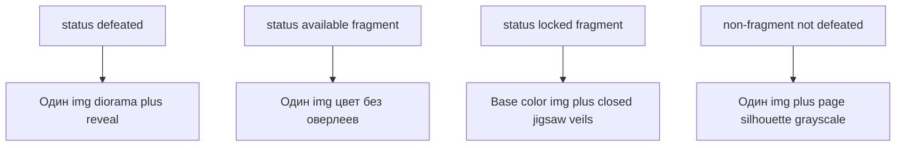

# Пазловая иллюстрация фрагментных духов в книге

## Цель для игрока

На правой странице бестиария прогресс осколков виден на самой картинке: **k / N** — k зон в цвете, **N − k** jigsaw-кусочков держат тот же визуальный «силуэт», что сейчас (`grayscale`). При **N/N** (дух `available`, викторина ещё не пройдена) — **вся иллюстрация в цвете**, без пазлов-оверлеев. После победы — текущее поведение (`book-illustration--diorama`, reveal-анимация).

## Текущая точка входа

- Рендер: [`src/ui/book/BookOverlay.tsx`](src/ui/book/BookOverlay.tsx) — один ``, класс `book-page--silhouette` при `status !== 'defeated'`.
- Фильтр: [`src/ui/index.css`](src/ui/index.css) `.book-page--silhouette .book-illustration { filter: grayscale(1); }`.
- Данные: `gameStore.fragmentCounts[spiritId]`, `spirit.unlock.fragmentCount`, `isFragmentSpirit()` из [`src/domain/spiritQueue.ts`](src/domain/spiritQueue.ts).
- **Канон чисел фрагментов:** [`instruction/plans/draft.md`](instruction/plans/draft.md) §8 (сумма **43**). В коде — `fragmentRequirements` в [`src/config/lootTables.ts`](src/config/lootTables.ts) и `unlock.fragmentCount` в [`src/data/spirits.ts`](src/data/spirits.ts); перед сдачей эпика значения **1:1** с draft (и `loot_tables.test.ts` / `list_of_spirits.md` при расхождении).

| Дух (`spiritId`) | N | Очередь |
|------------------|---|---------|
| `baba_yaga` | **3** | 1 (первая в очереди осколков; см. draft §8 — не за Банника) |
| `lada` | **3** | 2 |
| `veles` | **6** | 3 |
| `koschei_immortal` | **5** | 4 |
| `chudo_yudo` | **8** | 5 |
| `yarilo` | **8** | 6 |
| `perun` | **10** | 7 |

Уникальные размеры jigsaw-layout (по N): **3, 5, 6, 8, 10** — семь духов делят эти пять сеток.

## Поведение по состояниям



| Условие | Правая страница |
|---------|-----------------|
| `!isFragmentSpirit` и не `defeated` | как сейчас: `book-page--silhouette` |
| `isFragmentSpirit`, `locked`, `have < N` | пазл: база в цвете + **(N − have)** jigsaw-оверлеев с `grayscale` |
| `isFragmentSpirit`, `available` (have ≥ N) | один img, **без** silhouette и **без** пазлов |
| `defeated` | без изменений логики reveal/diorama |

**Порядок открытия кусочков:** индексы `0 … have−1` открыты, `have … N−1` закрыты (слева направо, сверху вниз в сетке layout для данного N). Согласовано с текстом «3 / 8» на левой странице.

## Архитектура

### 0. Синхронизация баланса (prerequisite)

Если в репо ещё старые числа (например Велес 7, сумма 46): привести к draft §8 — **3+3+6+5+8+8+10 = 43**, очередь **Яга → Лада → Велес → Кощей → Чудо-Юдо → Ярило → Перун**. Точки правки: `lootTables.ts`, `spirits.ts`, при необходимости `instruction/dev/loot_tables.md`, `list_of_spirits.md`, миграция сейва не нужна (только cap/requirements, не накопленные счётчики). Пазлы читают N из `spirit.unlock.fragmentCount`, не хардкодят 8.

### 1. Конфиг layouts (уникальные N = 3, 5, 6, 8, 10)

Новый модуль [`src/config/bookFragmentPuzzleLayouts.ts`](src/config/bookFragmentPuzzleLayouts.ts):

- `getFragmentPuzzleLayout(pieceCount: number): { viewBox: string; pieces: { id: string; pathD: string }[] }`
- Для каждого **уникального** `pieceCount` из draft §8 / `fragmentRequirements` — **ровно N** SVG path в общей системе координат (например `0 0 1000 1000`), форма с «клювами» (jigsaw), без привязки к конкретному духу.
- Сетки-основа: 3→1×3, 5→5×1 или 2+3, 6→3×2, 8→4×2, 10→5×2 (зафиксировать в комментарии к layout; визуально — jigsaw по границам ячеек).

Пути можно начать с **процедурно-стилизованных** кривых (дуги на границах ячеек), затем при необходимости подменить эталонными из дизайна — без смены API компонента.

### 2. Чистая логика (тестируемая)

[`src/domain/bookFragmentPuzzle.ts`](src/domain/bookFragmentPuzzle.ts):

- `isClosedPieceIndex(index: number, revealedCount: number): boolean`
- `assertFragmentPuzzlePieceCount(pieceCount)` — только допустимые N из loot table

Тесты: [`src/domain/bookFragmentPuzzle.test.ts`](src/domain/bookFragmentPuzzle.test.ts) + тест layout: для каждого N длина `pieces === N`, id уникальны.

### 3. UI-компонент

Новый [`src/ui/book/BookFragmentPuzzleIllustration.tsx`](src/ui/book/BookFragmentPuzzleIllustration.tsx):

- Props: `spiritId`, `revealedCount`, `totalCount`, `className` (diorama/revealing), `onAnimationEnd`.
- Структура DOM:

```text
.book-illustration-puzzle
  img.book-illustration.book-illustration-puzzle__base   (цвет, без grayscale)
  svg defs clipPath#piece-{i}  (из layout)
  для каждого closed i:
    .book-illustration-puzzle__veil-piece
      img.book-illustration.book-illustration-puzzle__veil-img  (тот же src, filter grayscale)
```

- Выравнивание veil-img с base: общий контейнер с теми же правилами ширины, что сейчас у `.book-illustration` (`width: 120%`, `object-fit: contain`); veil-кусочки — `position: absolute; inset: 0` на контейнере, внутренний img с **CSS-переменными** только если нужно (предпочтительно один размер base + `clip-path: url(#…)` на veil-piece без сдвига img, если path в координатах viewBox масштабируется через `clipPathUnits="objectBoundingBox"` или нормализованные path 0–1).

- `aria-hidden` на декоративных слоях; прогресс остаётся в тексте слева.

### 4. Интеграция в BookOverlay

В [`src/ui/book/BookOverlay.tsx`](src/ui/book/BookOverlay.tsx):

- Вычислить `total = spirit.unlock.fragmentCount ?? 0`, `have = fragmentCounts[spiritId] ?? 0`.
- `useFragmentPuzzle = isFragmentSpirit(spiritId) && status === 'locked' && total > 0 && have < total`.
- `useFullColorFragment = isFragmentSpirit(spiritId) && status === 'available'` (или `have >= total` при locked edge — не должно случаться при корректном store).
- Правая страница: `book-page--silhouette` только если `status !== 'defeated' && !useFragmentPuzzle && !useFullColorFragment`.
- Ветка рендера: `useFragmentPuzzle` → `BookFragmentPuzzleIllustration`, иначе текущий одиночный `img`.

Обновить комментарий в [`src/ui/book/spiritIllustrationUrl.ts`](src/ui/book/spiritIllustrationUrl.ts).

### 5. CSS ([`src/ui/index.css`](src/ui/index.css))

- Стили `.book-illustration-puzzle`, `__base`, `__veil-piece`, `__veil-img` (veil: `filter: grayscale(1)`; опционально лёгкий `brightness` для контраста с пергаментом — один раз в CSS, не inline).
- Тонкая «линия реза» между кусочками: `stroke` в path или `gap` + фон пергамента — на visual-check.
- `prefers-reduced-motion`: без анимации снятия кусочка (MVP — статичное состояние; анимация при дропе осколка — **вне scope**, P1).
- Не ломать `.book-illustration--revealing` / `--diorama` на base img при `defeated`.

### 6. Контракт CSS-тестов

Расширить [`src/config/bookLayoutCss.test.ts`](src/config/bookLayoutCss.test.ts): наличие классов пазла и правило, что veil-img использует grayscale; silhouette по-прежнему для не-фрагментных.

## Критерии приёмки

- Счётчики в UI и пазлы соответствуют draft §8 (например Баба-Яга **3**, Велес **6**, Кощей **5**, не устаревшие 7/7).
- Баба-Яга `1/3`: один jigsaw-кусочек в цвете, два с фильтром (типичный кейс после первой полной ежедневки).
- Чудо-Юдо `0/8`: все 8 jigsaw-зон с фильтром, силуэт читается как сейчас, но с швами пазла.
- Чудо-Юдо `3/8`: три кусочка в цвете, пять с фильтром; счётчик слева без изменений.
- `N/N`, `available` (любой фрагментный дух): полный цвет, **нет** оверлеев и **нет** page-level grayscale.
- Перун `10/10` до викторины — полный цвет; layout на **10** кусочков без отдельных ассетов на духа.
- Дух с `after_spirit` lock: по-прежнему цельный grayscale.
- `defeated`: reveal/diorama как до задачи.
- `npm test` зелёный; visual-check владельца: jigsaw на landscape, flip страницы (`useBookPageFlip`) — кусочки не съезжают.

## Вне scope (P1)

- Анимация снятия кусочка при `+1` фрагмент в лут-модалке.
- Мини-сетка N клеток на левой странице под текстом прогресса.
- Отдельные SVG-маски «под существо» (только generic jigsaw по N).

## Маршрут (workflow)

Полная цепочка для механики UI: проектировщик → тестировщик (падающие тесты domain/layout) → разработчик → ревьювер + **visual_check** jigsaw на mockup [`instruction/design/book_bestiary_mockup_landscape.png`](instruction/design/book_bestiary_mockup_landscape.png) по зоне иллюстрации.

## Ключевые файлы

| Файл | Действие |
|------|----------|
| `src/config/bookFragmentPuzzleLayouts.ts` | новый |
| `src/domain/bookFragmentPuzzle.ts` + `.test.ts` | новый |
| `src/ui/book/BookFragmentPuzzleIllustration.tsx` | новый |
| `src/ui/book/BookOverlay.tsx` | ветвление рендера / silhouette |
| `src/ui/index.css` | стили пазла |
| `src/config/bookLayoutCss.test.ts` | контракт |
| `instruction/dev/tasks.md` | TASK-запись (опционально, при принятии эпика) |
