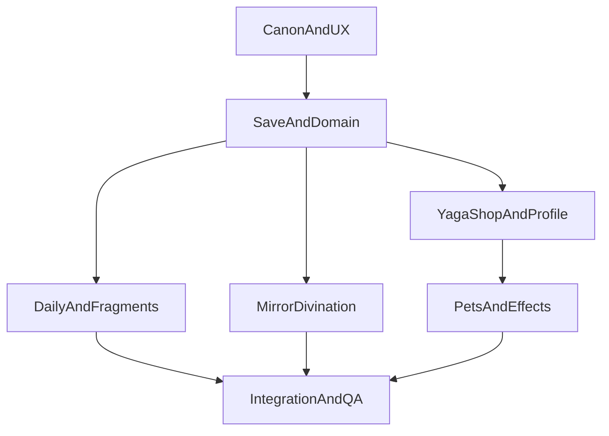

# Глобальное обновление из draft

## Цель и границы

Внедрить все мета-функции из [draft.md](l:/Frontend/games/slavic_myths/instruction/plans/draft.md): зеркало-гадание, свечи и вещие крупицы, ежедневные задания, лавку Яги, питомцев, четыре эффекта избы и общую очередь фрагментов. Уже реализованную атмосферу `thunder_izba` не заменять: расширить существующий каталог эффектов.

Перед разработкой зафиксировать единый канон между [draft.md](l:/Frontend/games/slavic_myths/instruction/plans/draft.md), [scenario.md](l:/Frontend/games/slavic_myths/instruction/scenario.md), [quests.md](l:/Frontend/games/slavic_myths/instruction/quests.md) и runtime-данными. В частности, порядок фрагментов должен быть `baba_yaga → lada → veles → koschei_immortal → chudo_yudo → yarilo → perun`, а `thunder_izba` остаётся отдельной не-магазинной наградой Перуна.

## Фаза 0 — Канон, UX и контракты

- Создать задачи Epic 16 с отдельными acceptance criteria и зависимостями для всех нижеописанных фаз; не менять статус существующих задач Epic 13–15 без их собственных gates.
- Синхронизировать сценарий, список духов, награды, порядок бестиария и генерацию викторин с принятым каноном. Устранить зафиксированные расхождения `quests.md` ↔ `src/data/quiz.ts` / `spirits.ts` до того, как ежедневка начнёт брать вопросы из викторин.
- Подготовить UX-спеки и mockup-план:
  - неактивное/активное зеркало справа от книги и полноэкранный сеанс;
  - компактная панель двух ежедневных задач слева, не перекрывающая HUD;
  - лавка Яги с вкладками крупиц и IAP-свечей;
  - профильные вкладки питомцев и эффектов.
- Утвердить asset manifest и fallback для зеркала, дыма, портретов, семи скинов кота, трёх питомцев и четырёх эффектов; production-ассеты добавлять только после owner visual approval.

## Фаза 1 — Домен, save и локализованные каталоги

- Расширить [GameSave.ts](l:/Frontend/games/slavic_myths/src/domain/GameSave.ts), миграции и `GameStore` для:
  - свечей без лимита, вещих крупиц, разовой выдачи свечи за первую победу над каждым духом;
  - состояния ежедневки по календарному дню, назначенного духа сказа, прогресса кликов и выполнения двух пунктов;
  - владения/выбора питомца и эффектов избы;
  - уже купленных товаров лавки и идемпотентных транзакций.
- Добавить чистые domain-функции для календарного дня, выбора духа сказа без немедленного повтора, выдачи следующего фрагмента и проверки покупок. Время и RNG передавать явно для тестируемости.
- Вынести каталоги в `src/data/`: предметы лавки, дивинационные тексты, truth-table, питомцы и расширенный `izbaEffects`. Все пользовательские строки хранить RU/EN/TR, не использовать runtime-ID как UI-лейбл.
- Описать SDK-контракт покупки свечи: цена и entitlement приходят из каталога платформы, UI не содержит рублей и не начисляет свечи до подтверждённого успешного платежа.

## Фаза 2 — Ежедневка и единая фрагментная очередь

- Заменить/мигрировать существующий daily-find на две задачи draft: 100 кликов и «сказ дня + один верный вопрос» без затрат энергии и без лимита повторных попыток.
- Открывать ежедневку в сессии победы над Банником; не выдавать фрагмент за само открытие.
- Использовать существующие `miniTale` и `spiritQuizzes`: фиксировать дух на календарный день, показывать сказ, затем выбирать и перемешивать один вопрос этого духа.
- Централизовать выдачу фрагментов для ежедневки, сундука чудес и будущего loot: каждый источник получает первого locked-духа из канонической очереди с незакрытой нормой; selected target влияет только на подсветку в книге.
- **Завершение фрагментной цепочки (решение владельца):** когда у игрока собраны все фрагменты по канонической очереди (43/43, все фрагментные духи разблокированы или побеждены — уточнить в domain-инварианте при реализации), панель ежедневки **полностью скрывается**; замены награды и «пустой» daily UI нет. До этого момента ежедневка видна с момента победы над Банником.

## Фаза 3 — Зеркало и игровой сеанс гадания

- Добавить сценический проп зеркала в комнату 1 с канонической слоистостью избы, натуральным размером PNG и отдельной hit-area; до победы над Ягой — серое стекло и реплика кота без открытия модалки.
- Реализовать state machine: закрыто → порог → потратить свечу по «Спросить» → дым/приветствие → два разных вопроса → выбор имени → reveal портрета/итог → выдача 10 или 3 крупиц. Закрытие после подтверждения не возвращает свечу и не выдаёт крупицы.
- Выбирать дух только из `defeated` после подтверждения сеанса, держать один `SpiritId` весь сеанс, показывать все имена при пуле до 8 либо верный плюс 7 случайных при большем пуле.
- Подключить сокращённое движение: дым остаётся статичным/без смещения при `prefers-reduced-motion`; HUD викторины в сеансе не монтируется.

## Фаза 4 — Лавка Яги, профиль и витринные предметы

- Открывать лавку только после первой победы над Ягой; показать все товары сразу, не привязывать ассортимент к дальнейшим главам.
- Реализовать транзакции за крупицы: скины кота (30), пять титулов (10), питомцы (25), четыре магазинных эффекта (15). Не допускать повторной покупки, отрицательного баланса или продажи запрещённых фрагментов, оберегов, скинов избы и награды Перуна.
- Реализовать отдельную вкладку платных свечей через платформенный каталог и обновить loot-пулы: перенести «Дымок»/«Волшебство» из сундуков в лавку без изъятия уже полученных владений.
- Добавить в профиль выбор ровно одного питомца или none и ровно одного эффекта или none. Существующая вкладка «Атмосфера» с `thunder_izba` остаётся совместимой с новыми магазинными эффектами.

## Фаза 5 — Отрисовка питомцев, эффектов и визуальная приёмка

- Отрисовать экипированного питомца как некликабельного компаньона у кота с `sit`/`sleep`, без генерации монет и без замены самого кота.
- Расширить `IzbaEffectLayer` для тумана, огонька, шаровой молнии и звёздного неба; сохранить правило одного активного эффекта, `pointer-events: none`, pan обеих комнат и reduced-motion fallback.
- Не менять эталонные классы комнаты 1; в комнате 2 оставить тот же `.layer-izba`, `WindowAperture` и натуральные размеры мебели/полок. Выполнить visual check зеркала, daily-панели, лавки, профиля и всех эффектов на day/night и в обеих комнатах.

## Фаза 6 — Тесты, миграция и сдача

- До production-кода каждой фазы добавить красные тесты: миграция save, идемпотентность наград, календарные reset-правила, RNG-ограничения, состав гадания, покупка/SDK error, экипировка, fragment routing и локализация.
- Добавить component/CSS-contract тесты для отсутствия кликабельности FX, единственного выбранного питомца/эффекта, доступности зеркала и reduced motion.
- Прогнать целевые unit-тесты, полный test/build, lints затронутых файлов и ручную визуальную приёмку. Статус задач переводить в `done` только после approved review и подтверждённого visual-check.

## Зависимости

- Ежедневка и гадание могут разрабатываться параллельно после готового save/domain-контракта.
- Лавка зависит от валюты крупиц и модели ownership, но от завершения ежедневки не зависит.
- Визуальные эффекты зависят от ownership/equip API и принятой UX-спеки.
- Asset acceptance остаётся внешним gate; поведение ежедневки после сбора всех фрагментов зафиксировано (скрытие UI).