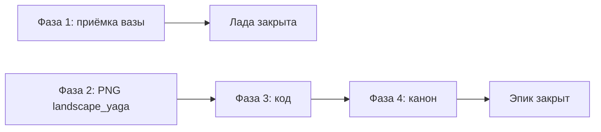

# Награды квестов Лада и Яга

**Решение владельца (2026-09-08):** вернуть в план награды из итерации аудита:

| Дух | Награда | Тип | ID |
|-----|---------|-----|-----|
| **Лада** | Гармония-ваза на полку | Трофей | `lada_harmony_vase` |
| **Лада** | Титул «Гость Лада» | Титул | `gost_lada` |
| **Баба-Яга** | Избушка на полке | Трофей | `yaga_hut` |
| **Баба-Яга** | Вид из окна — избушка на курьих ножках | Скин «Лес» | `landscape_yaga` |
| **Баба-Яга** | Титул «Коготь Яги» | Титул | `kogot_yagi` |

**Вне этого эпика:** скин избы `hut_harmony` (квест Лады) — остаётся backlog P2; не блокирует трофей-вазу.

**Перебивает:** `instruction/plans/quiz_draft_migration_bd11c388.plan.md` → «Asset-TASK (hut_harmony, landscape_yaga) — отменены» — **отмена снята только для `landscape_yaga`**.

---

## Текущее состояние (аудит 2026-09-08)

| Пункт | Код / ассет | Статус |
|-------|-------------|--------|
| Трофей Лады | `assets/trophies/lada_harmony_vase.png`, `assetRegistry`, `hasTrophy` | ✅ реализовано; нужна визуальная приёмка |
| Трофей Яги | `assets/trophies/yaga_hut.png`, полка комнаты 2 | ✅ реализовано |
| Скин окна Яги | `landscape_yaga.jpeg` | ✅ реализовано |
| `SpiritReward.skinId` | тип есть, `applySpiritReward` `title_and_skin` | ✅ реализовано |

---

## Фаза 1 — Лада: трофей-ваза (приёмка)

**Канон:** `design_assets_prompts.md` §419–432, `list_of_spirits.md`, `scenario.md` §5.5.

1. Визуальная приёмка `lada_harmony_vase.png`:
   - глиняная гармония-ваза, узкое горло, **две** ручки;
   - красно-чёрный орнамент, не generic-ваза / не греческая амфора;
   - белый фон, palm-sized для полки.
2. `assets_catalog.md` → `lada_harmony_vase.png` статус ✅.
3. Smoke: победа над Ладой → титул в профиле → ваза на полке (комната 2) → `.room-trophy-slot--reveal`.

**Код:** менять не обязательно — пайплайн трофеев универсальный (`GameStore.claimVictory` + `trophiesUnlocked`).

---

## Фаза 2 — Яга: `landscape_yaga` (ассет)

**Канон:** `design_assets_prompts.md` §703–736, `izba_scene_layers.md` §1.4, `profile_layout.md` §6.3.

### 2.1 Генерация PNG

- Путь: `assets/view/landscape_yaga.jpeg`
- Формат: **21:9** ultrawide
- Композиция:
  - избушка на курьих ножках **целиком в зоне оконного проёма** (~38% ширины сцены);
  - высота избушки ≈ **60–75%** высоты проёма;
  - сумеречный лес вокруг; без персонажей, без рамки окна на PNG.
- Референсы: `landscape_standart.jpeg`, `baba_yaga.png`, `yaga_hut.png` (масштаб фигурки)

### 2.2 Приёмка в сцене

- [ ] `WindowAperture` комнаты 1 и 2: избушка читается за стеклом, не обрезана наличником
- [ ] Не путать с `landscape_temnyy_les` (тёмный лес без избушки)
- [ ] Ночной режим: тот же фильтр, что на активном скине окна

---

## Фаза 3 — Яга: код награды

### 3.1 Реестр и профиль

| Файл | Действие |
|------|----------|
| `src/config/assetRegistry.ts` | `landscape_yaga` в `viewSkins` |
| `src/data/skinContent.ts` | RU/EN/TR («Избушка Яги» / …) |
| `src/data/profileCatalog.ts` | ячейка в вкладке «Лес», грейд `epoch` |
| `src/data/skinPools.ts` | **не** добавлять в сундук |

### 3.2 Domain

1. Новый `SpiritRewardKind`: `title_and_skin` (или расширить `title_only` + `skinId`).
2. `applySpiritReward.ts`:
   - добавить `skinId` в `ownedSkinIds`;
   - **без** авто-экипировки (`skins.window` не менять) — как сундук после итерации исправлений.
3. `spirits.ts` — `baba_yaga.reward`:
   ```ts
   { kind: 'title_and_skin', titleId: 'kogot_yagi', skinId: 'landscape_yaga' }
   ```
4. `bookRewardDescription`: титул + трофей на полку + вид из окна.

### 3.3 Тесты

- `applySpiritReward.test.ts` — `ownedSkinIds` содержит `landscape_yaga`, `skins` не меняется
- `GameStore` — claim victory `baba_yaga`: титул + трофей + скин в owned

### 3.4 Миграция сейвов (если нужно)

Игроки, уже победившие Ягу до патча: при входе добавить `landscape_yaga` в `ownedSkinIds`, если `spiritStatuses.baba_yaga === 'defeated'`.

---

## Фаза 4 — Синхронизация канона

| Файл | Правка |
|------|--------|
| `list_of_spirits.md` | `bookRewardDescription` Яги: титул + трофей + скин окна; мини-сказ «ключ к виду из окна» |
| `spirits.ts` | `miniTale` Яги — вернуть строку про вид из окна (сейчас урезан под викторину v2) |
| `scenario.md` §5.5 | Строка Яги: доп. колонка или примечание про `landscape_yaga` |
| `design_assets_prompts.md` | снять ⏸ с §`landscape_yaga` |

**Не трогать в этом эпике:** `hut_harmony`, эталон CSS комнаты 1/2, викторина Яги.

---

## Критерии приёмки эпика (сводка)

- [x] Лада: ваза на полке после победы; PNG принят по промпту
- [x] Яга: титул + трофей-избушка + `landscape_yaga` в owned (не экипирован автоматически)
- [x] Профиль «Лес»: ячейка `landscape_yaga`, локализованное имя
- [x] Сундук **не** выдаёт `landscape_yaga`
- [x] Старые сейвы с победой над Ягой получают скин (миграция)
- [x] Тесты зелёные

---

## Зависимости и порядок



**TASK в dev:** `instruction/dev/tasks.md` → Epic 12 (TASK-025 … TASK-027).
