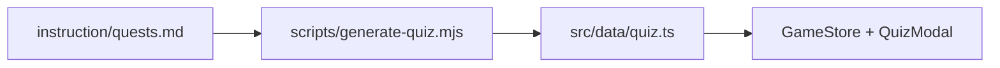

# Замена викторины на редакцию из draft.md

## Контекст

Сейчас викторина живёт в цепочке:



UI викторины ([`QuizModal.tsx`](src/ui/quiz/QuizModal.tsx), shuffle, обереги, прогресс-точки) **менять не нужно** — они уже поддерживают произвольное число вопросов.

[`draft.md`](instruction/plans/draft.md) — новая редакция: **122 вопроса** (было ~97), обновлённые формулировки без архаики, новые вопросы у 10 духов, плюс новые крючки/проигрыши/мини-сказы.

Вы выбрали **полную синхронизацию** с draft, включая награды.

## Ключевые расхождения с текущим кодом

| Дух | Вопросов (было → стало) | Награда в draft vs код |
|-----|-------------------------|-------------------------|
| Домовой | 3 → **4** | без изменений механики |
| Леший | 6 → **7** | без изменений |
| Топтыгин | 5 → **6** | без изменений |
| Полудница | 7 → **8** | **+15 max energy** вместо `day_coin_bonus` 10% |
| Русалка | 6 → **8** | **титул «Кот у берега» + 10 энергии** вместо `night_zhirdyay_reduction` 20% |
| Лада / Велес / Яга / Кощей / Чудо-Юдо | 6–8 → **8–13** | тексты наград уточнены; механика совпадает |

Два reward-изменения требуют правок домена, не только контента:

```293:314:src/data/spirits.ts
    reward: { kind: 'day_coin_bonus', percent: 10 },
    // ...
    reward: { kind: 'night_zhirdyay_reduction', percent: 20 },
```

## Шаг 1 — Промote draft в канон markdown

**Источник:** [`instruction/plans/draft.md`](instruction/plans/draft.md), строки 1–927 (16 секций духов).

**Не копировать:** блок «Задания оркестратора» (строка 929+) — это отменённые asset-TASK.

**Обновить файлы:**

1. **[`instruction/quests.md`](instruction/quests.md)** — заменить целиком викторинным содержимым из draft:
   - регламент по грейдам и правила текста;
   - сводная таблица с новыми числами вопросов;
   - все 16 квестов с `(верный)` маркерами.
   - Сохранить формат, который парсит [`scripts/generate-quiz.mjs`](scripts/generate-quiz.mjs) (`## Дух — N вопрос`, `### Вопрос N`, `- … *(верный)*`).

2. **[`instruction/list_of_spirits.md`](instruction/list_of_spirits.md)** — синхронизировать:
   - `loseMessage`, `miniTale`, `catHook` (если есть в каноне);
   - сводку наград: Полудница → `+15 max energy`; Русалка → титул «Кот у берега» + 10 энергии.

3. **[`instruction/tituls.md`](instruction/tituls.md)** — заменить квестовый титул Русалки:
   - «Лунный Слушатель» → **«Кот у берега»** (id в коде: `kot_u_berega`).

4. **[`instruction/cat_dialogs.md`](instruction/cat_dialogs.md)** — обновить RU-реплики крючков и проигрыша по draft (§3–5).

5. **[`instruction/plans/draft.md`](instruction/plans/draft.md)** — обновить шапку: статус «принято → quests.md от …».

## Шаг 2 — Перегенерировать викторину

```bash
npm run generate:quiz
```

Проверить вывод: **16 квизов, ~122 вопроса**.

Файл [`src/data/quiz.ts`](src/data/quiz.ts) перезаписывается скриптом; ручные правки в нём не нужны.

## Шаг 3 — Синхронизировать runtime-данные

### [`src/data/spirits.ts`](src/data/spirits.ts)

Для каждого из 16 духов из generated quiz / draft:

- `loseMessage`, `miniTale` — из draft;
- `bookRewardDescription` — из строки **Награда** draft;
- **reward patch:**
  - `poludnica`: `{ kind: 'max_energy', amount: 15 }`
  - `rusalka`: `{ kind: 'title_and_energy', titleId: 'kot_u_berega', amount: 10 }`

Обновить тексты, где draft меняет формулировки (примеры):
- Банник catHook: «…любит порядок и уважение — не геройствуй»;
- Полевой lose: «По полям, по полям…»;
- Овинник lose: «Шухер! Прятки!…»;
- Лада miniTale: «…Гармония-ваза…».

### [`src/data/spiritCatDialogContent.ts`](src/data/spiritCatDialogContent.ts)

Обновить `questHook` и `loseLine` (RU) для всех изменённых духов; EN/TR — перевести новые RU-строки в том же стиле, что существующие локализации.

### Титулы

- [`src/data/titles.ts`](src/data/titles.ts): заменить `lunnyy_slushatel` на `kot_u_berega` (grade `epic`, source `quest`, spirit `rusalka`).
- [`src/data/titleContent.ts`](src/data/titleContent.ts): локализованное имя «Кот у берега» / "Shore Cat" / …

## Шаг 4 — Домен наград и UI книги

1. **[`src/domain/applySpiritReward.ts`](src/domain/applySpiritReward.ts)**  
   - Оставить `case 'day_coin_bonus'` и `case 'night_zhirdyay_reduction'` для обратной совместимости сохранений, но ни один дух больше их не выдаёт.

2. **[`src/ui/book/BookOverlay.tsx`](src/ui/book/BookOverlay.tsx)**  
   - Блок `day_coin_bonus` для Полудницы станет мёртвым — можно убрать или оставить на будущее; после смены reward он не рендерится.

3. **`rusalkaZhirdyayReductionPercent`** в [`GameSave`](src/domain/GameSave.ts) / [`zhirdyay.ts`](src/domain/zhirdyay.ts) — **не удалять**: старые сейвы могут иметь 20% reduction; новые прохождения просто не добавят бонус.

4. **Миграция сейва (минимальная):** в [`saveMigration.ts`](src/domain/saveMigration.ts) при `completedSpirits` содержит `rusalka` и нет `kot_u_berega` — добавить титул; при `poludnica` — если был только `poludnicaCoinBonusPercent`, начислить +15 max energy один раз (опционально, но желательно для честности full_draft).

## Шаг 5 — Тесты

| Файл | Что обновить |
|------|--------------|
| [`src/data/quiz.test.ts`](src/data/quiz.test.ts) | 16 квизов; `brownie.questions.length === 4`; total ≈ 122 |
| [`src/domain/applySpiritReward.test.ts`](src/domain/applySpiritReward.test.ts) | тесты для poludnica `max_energy +15` и rusalka `title_and_energy` |
| [`src/store/GameStore.test.ts`](src/store/GameStore.test.ts) | brownie-квест: 4 вопроса до victory (цикл по `correctIndex` уже универсален) |
| [`src/data/data.test.ts`](src/data/data.test.ts) | если проверяет id титулов — `kot_u_berega` |

Запуск: `npm test`.

## Шаг 6 — Приёмка

- [ ] `npm run generate:quiz` → 16 / ~122 без warnings «Unknown spirit»
- [ ] Домовой: 4 вопроса, 4-й про сапоги у порога
- [ ] Полудница: 8 вопросов; награда +15 max energy в книге и после claim
- [ ] Русалка: 8 вопросов; титул «Кот у берега» + 10 энергии
- [ ] Нет архаики в UI («матушка», «коли», «поклон») в обновлённых квестах
- [ ] `grep` по `lunnyy_slushatel` — только миграция/история, не активный квест
- [ ] Все тесты зелёные

## Scope вне задачи

- Asset-TASK из хвоста draft (hut_harmony, landscape_yaga) — **отменены**, не трогаем.
- CSS викторины, фоны локаций, логика оберегов — без изменений.
- Перевод EN/TR — синхронизировать вместе с RU, без отдельного этапа «потом».

## Риски

- **Длинные эпик-квесты** (12–13 вопросов) увеличивают время прохождения и расход оберегов — это осознанный баланс draft.
- **Старые сейвы:** игроки с пройденной Русалкой/Полудницей могут иметь устаревшие пассивки без миграции — закрывается шагом 4.4.
