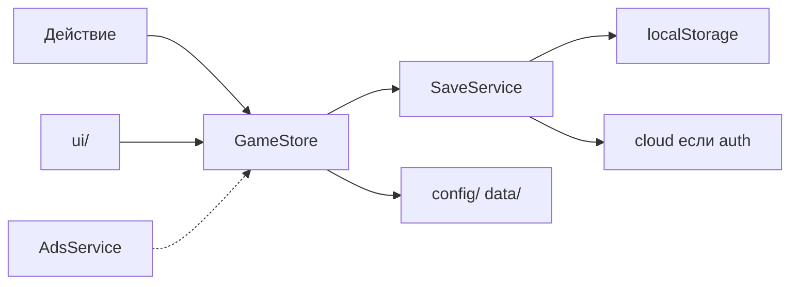
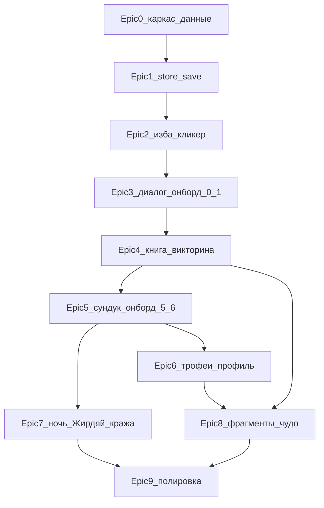

# План реализации по ТЗ

Канон готов, бэклог пуст: [`instruction/dev/tasks.md`](instruction/dev/tasks.md) и [`instruction/dev/tech.md`](instruction/dev/tech.md) — шаблоны. В коде есть только [`src/config/assetRegistry.ts`](src/config/assetRegistry.ts), [`src/config/sceneLayout.ts`](src/config/sceneLayout.ts), [`src/config/lootTables.ts`](src/config/lootTables.ts), [`src/domain/grade.ts`](src/domain/grade.ts). Нет `package.json`, Vite, React, store, UI, `src/data/*`.

**Scope этой волны** — тестовый режим ([`technical_requirements.md`](instruction/dev/technical_requirements.md) §10): изба, трофеи, книга, кот, онбординг, 16 духов, викторины, фрагменты, сундук 3 ч, rewarded-заглушка, ночь/Жирдяй, кража Суседко, localStorage.

**Вне scope:** реальный SDK Яндекс.Игр, облако, видео, платежи, «обереги на улице», сезонные ивенты, позы кота `stand`/`hunt` (ассетов нет).

Каждый эпик в коде идёт по пайплайну проекта: `tasks.md` → `tech.md` → красные тесты → код → ревью. Не кодить всю игру одним PR.

---

## Анализ ТЗ: что уже решено

Три опоры продукта: клик → монета; сундук / дух / ночь как причина вернуться; викторина как знакомство с фольклором, не экзамен.

Слои кода зафиксированы: `ui/` · `store/` · `services/` · `platform/` · `domain/` · `config/` · `data/`. UI не вызывает SDK; persist не знает про рекламу.

**Игровой цикл до первого сундука** (критичный D1, &lt; 8 мин): шаг 0 кот → 1 книга → 2 викторина Домового → 3 награда + крючок Суседко → 4 викторина Суседко → 5 сундук сразу → 6 прощание. Пока онбординг не `completed`: клик кота не тратит энергию, квесты Домовой/Суседко = 0 энергии, floor энергии ≥ 20.

**Прогрессия духов:** мягкая очередь 1–2 `available`. Ключи сундука: Полудница, Топтыгин, Русалка. Фрагменты: Лада 3 / Яга 3 / Велес 4 / Кощей 6 / Чудо-Юдо 6. Главный канал фрагментов — Сундук чудес (25% + pity 8).

**Сцена:** одна панорама inner 200%, pan комната 1↔2. Канон слоёв — [`izba_scene_layers.md`](instruction/izba_scene_layers.md) (при конфликте с §3 техтребований побеждает этот файл). Камера комнаты 1 держит окно + кота + книгу.

---

## Дыры и конфликты (закрыть в архитектуре Epic 0–1)

Не выдумывать лор — только технические решения, которых нет в `GameSave`:

- **Реген энергии** (1/мин) не из чего считать: в [`scenario_draft.md`](instruction/scenario_draft.md) §2.1 нет `lastEnergyAt`. Добавить timestamp в `GameSave`.
- **Сброс ночи / Жирдяя:** есть `zhirdyaySeenThisNight`, нет идентификатора ночи (локальная дата рассвета 06:00).
- **Запасной ключ** обычного сундука: «макс. хранение уточнить в коде» ([`scenario.md`](instruction/scenario.md) §5.4). Предложение: `spareChestKeys: number`, cap **3**.
- **`onboardingStep`:** число 0–6 vs `'completed'`. Хранить `onboardingStep: 0..6` + `onboardingCompleted: boolean` (или step=6 и флаг); `toSave`/`hydrate` — единственный маппинг.
- **Веса предметов обычного сундука** в [`loot_tables.md`](instruction/dev/loot_tables.md) — «при реализации». Сейчас в [`lootTables.ts`](src/config/lootTables.ts) только веса грейдов. Нужна таблица тип×грейд до Epic 5.
- **§3 техтребований** не содержит `.layer-fx` (70) и `.layer-susedko-steal` (55). Канон — `izba_scene_layers.md` / уже записано в `sceneLayout.ts`.
- **Полевой** в коде = `poludnik` (файл ассета), не `polevoy`.

**Арт, не блокирующий код** (fallback из каталога, не рисовать SVG):

- P0 арт: альфа стёкол избы (чёрный проём) → clip-path fallback §1.3; альфа рамок грейда; `book_of_spirits_open.png`; иконки HUD; деревянные стрелки.
- P1: фоны викторины, 3D-трофеи, Сундук чудес PNG, скин «Гармония», вид Яги за окном.
- Иллюстрации книги есть у 15 духов; у Домового — fallback гравюра.

---

## Epic 0 — Каркас и данные

Цель: проект собирается, конфиги импортируются, тесты крутятся. Ещё нет геймплея.

- Vite + React + TypeScript + MobX + Vitest + CSS. Скрипт `dev`, `isTestMode` из env.
- [`src/config/gameConstants.ts`](src/config/gameConstants.ts): энергия 100, клик −1/+1, квест −10, реген 1/мин, cap 200, обереги 3, sleep 45–60 с, сундук 3 ч, ночь 20:00–06:00, онбординг floor 20.
- [`src/data/spirits.ts`](src/data/spirits.ts) ← [`list_of_spirits.md`](instruction/list_of_spirits.md): id, grade, unlock, location, texts, reward type (не хардкод в UI).
- [`src/data/quiz.ts`](src/data/quiz.ts) ← [`quests.md`](instruction/quests.md): вопросы без маркера «верный» в рантайме; shuffle на старте.
- [`src/data/titles.ts`](src/data/titles.ts) ← [`tituls.md`](instruction/tituls.md): id, grade, source (`start` | `quest` | `chest` | `event`).
- Банки реплик кота по тегам [`scenario.md`](instruction/scenario.md) §8 + [`susedko_dialogs.md`](instruction/susedko_dialogs.md).
- `domain/GameSave.ts`: поля draft + дыры выше; `version: 1`; `createDefaultSave()`.

Дополнить [`lootTables.ts`](src/config/lootTables.ts) весами типов обычного сундука (скин/титул/ключ/сметана/оберег) — иначе Epic 5 гадает.

---

## Epic 1 — GameStore и local persist

Цель: любое действие сериализуется; гость играет без SDK.

- Один root `GameStore`: `toSave()` / `hydrate()` — единственный маппинг.
- Actions (пока без UI): `clickCat`, энергия/реген по `lastEnergyAt`, cap монет, статусы духов, онбординг-гварды.
- [`SaveService`](instruction/scenario_draft.md): debounce 2.5 с, `flush` на `beforeunload` / `visibilitychange`; ключ `slavic_myths_save_v1`; клики кота не пишут диск сразу.
- [`platform/`](instruction/dev/technical_requirements.md) §9: мок YaGames (`isTestMode`), облако = тот же localStorage; `openAuthDialog` — заглушка. Реальный SDK не подключать.
- `AdsService.showRewarded`: в тесте сразу `onRewarded()`. Interstitial не существует.

Инварианты для тестов: онбординг не жрёт энергию; floor 20; `pickBestSave` по `savedAt`; миграция `version`.

---

## Epic 2 — Сцена избы: слои, кот, HUD

Цель: открыл игру — видит избу, кликает кота, капают монеты.

- DOM-стек из [`izba_scene_layers.md`](instruction/izba_scene_layers.md): forest → fatso (скрыт) → izba → spirits → furniture → cat → night → fx → nav → hud. Позиции только из [`sceneLayout.ts`](src/config/sceneLayout.ts), пути из [`assetRegistry.ts`](src/config/assetRegistry.ts).
- Inner 200%, камера по якорям окна/кота/книги; pan стрелками края + свайп (пороги уже в `swipeThreshold`). Пока без комнаты 2 контента — правая половина пустая, но pan работает.
- Fallback окна: clip-path, пока стёкла чёрные.
- HUD: аватар+титул «Новенький», энергия, монеты, обереги ([`profile_layout.md`](instruction/profile_layout.md) §2). Профиль — заглушка/disabled до Epic 6.
- Клик по коту: −энергия (если не онбординг), +монета, FX `monete_v1.png`. Sleep по бездействию — логика в store, визуал sit/sleep.
- Ночной overlay `pointer-events: none` по локальным 20:00–06:00.

Первая вертикаль: кликер живой, save после паузы кликов.

---

## Epic 3 — Голос кота и онбординг шаги 0–1

- Компонент `.cat-dialog`: сноска vs новелла ([`cat_dialog_layout.md`](instruction/cat_dialog_layout.md)).
- Шаг 0: приветствие, клик по коту разрешён, книга/квесты заблокированы.
- Шаг 1: пульс книги, открыть книгу (модалка-заглушка разворота Домового достаточна, полный бестиарий — Epic 4).
- Тексты строго из таблицы §4.3 scenario.

---

## Epic 4 — Книга, викторина, очередь духов

Цель: полный квест-луп Домовой → Суседко (онбординг 2–4) и дальше по очереди.

- Бестиарий: полёт книги, разворот, статусы `available` / `defeated` / `locked`, лента глав, «В путь», закладка следующего ([`book_layout.md`](instruction/book_layout.md), [`scenario.md`](instruction/scenario.md) §5.1–5.3). Open-PNG нет — fallback closed + CSS, не выдумывать арт.
- Викторина: фон по локации духа + fallback фильтры; shuffle; «Вопрос X из Y»; ошибка −1 оберег; 0 оберегов → провал + `loseMessage`; победа → награда §5.5 + мини-сказ. Рекламы после квеста нет. Энергия −10, кроме онбординга Домовой/Суседко.
- После победы: только следующий дух очереди (не стена). Пауза: реплика кота, не автостарт следующего квеста.
- Награды сразу в store: Домовой на сцене (респавн зон `brownieSpawnZones`), сундук появляется после Суседко, +maxEnergy Банник/Топтыгин, обереги, титулы квестов, сметана, реген Лешего, дневной/ночной бонус Полудницы/Русалки, cap Кощея 220.

Онбординг шаги 2–4 закрываются этим эпиком.

---

## Epic 5 — Обычный сундук, лут, онбординг 5–6

Первый **играбельный milestone**: сессия &lt; 8 мин до сундука.

- Сундук после Суседко; первое открытие `chestReadyAt = null`; дальше +3 ч.
- Ролл из `lootTables` + удача домового (+1/2/3/5% rare+ по скину). Дубликаты по [`loot_tables.md`](instruction/dev/loot_tables.md). Epoch-титулы из этого сундука не падают.
- Модалка лута. Кнопка «Домовой шепчет: поторопи удачу (−30 мин)» → rewarded-заглушка.
- Онбординг 5: таймер 0, подсветка сундука. Шаг 6: прощание, `onboardingCompleted`.
- Повторный вход: кот спит (крючок кражи — Epic 7).

---

## Epic 6 — Трофеи и профиль

- Комната 2: 3 полки × 5 слотов из `trophySlotLayout`; Домового нет. Fallback трофея = гравюра. Клик → мини-сказ; пустой слот → «ещё не встречен».
- Профиль с аватарки HUD: сетка скинов кота/домового/избы/окна + все титулы; locked без «Выбрать»; экипировка пишет `skins` / `titleId` / `owned*`.

---

## Epic 7 — Ночь, Жирдяй, сон, кража Суседко

- Sleep 45–60 с бездействия. После Суседко+сундука: предупреждение 5 с → кража ещё +5 с → 1 монета / 3 с, stop-loss &lt; 15 монет. Стоп: **5 кликов по Суседко** (энергия 0); клик кота кражу не останавливает. Слой z 55, позиции `susedkoStealPositions`, реплики из [`susedko_dialogs.md`](instruction/susedko_dialogs.md).
- Жирдяй: ночь + в избе, 1 раз за ночь, 8–12 кликов. Блокирует клик-кота / сундук / квесты; не блокирует книгу, трофеи, профиль. Первый прогон → титул «Гроза Жирдяев». Прогресс не теряется.

---

## Epic 8 — Фрагменты и Сундук чудес

- Выбор locked-духа для дропа осколков; UI «собрано N/M».
- Сундук чудес: условие Суседко + ≥1 редкий дух; неделя = пн 00:00 локально; 1-е открытие цикла бесплатно; иначе 1000 кликов (Pay — не в этой волне). Pity 8. Утешительный пул + рероллы дубликатов.
- Фоновые фрагменты: обычный сундук ≤5%, дубликат скина/титула, победа rare+ разово.
- Ассет сундука чудес нет — fallback `box_*` + hue-rotate, как уже в `assetRegistry`.

---

## Epic 9 — Настройки, крючки удержания, сдача

- Настройки: сброс прогресса с подтверждением; кнопка «Войти через Яндекс» = мок (не блокирует UI).
- Мягкий баннер после первого сундука «Сохраним тайны в облаке?» — закрываемый, без `openAuthDialog` сам.
- Сноска при входе, если сундук готов.
- Чеклист [`technical_requirements.md`](instruction/dev/technical_requirements.md) §12 + [`scenario.md`](instruction/scenario.md) §13: пути/позиции/quiz/loot не в JSX; слои; профиль; `toSave`/`hydrate`; тесты зелёные.

---

## Порядок и зависимости

Epic 6 и 7 после сундука можно вести параллельно. Epic 8 нужен и бестиарий, и лут.

**Не дробить иначе:** викторину без книги не отдавать игроку; сундук без Суседко не показывать; кражу до появления сундука не включать.

После утверждения плана первый исполняемый шаг — заполнить `instruction/dev/tasks.md` эпиками TASK-* с критериями приёмки (роль проектировщика), затем секции `tech.md` на Epic 0–1.
