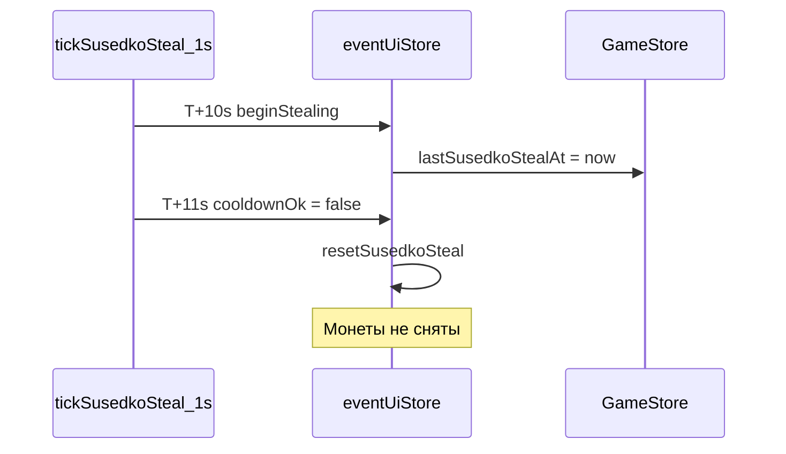
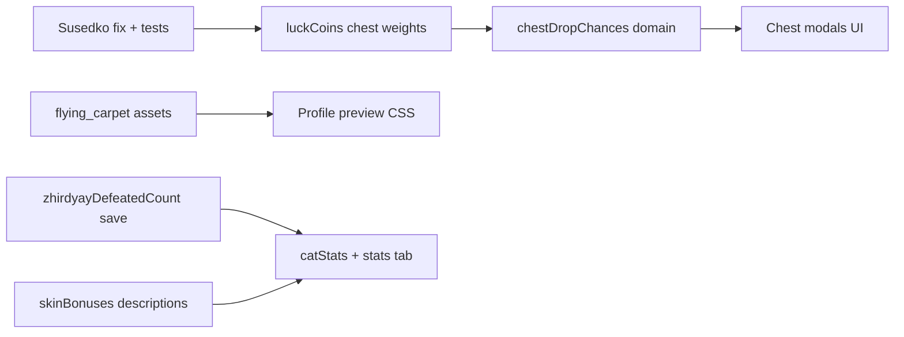

# Итерация: Суседко, шансы сундука, профиль

## Контекст по канону

| Понятие | Роль |
|---------|------|
| **Удача домового** | Скин домового: **+1 / +2 / +3 / +5%** к весам rare/epic/epoch в **обычном** сундуке (`scenario.md` §5.4, `loot_tables.md`) |
| **Монеты удачи** (`luckCoins`) | Клик по коту, cap 200 (+20 от Кощея); прогресс **Сундука чудес** (700 кликов). **Также:** каждая монета увеличивает вес rare/epic/epoch в обычном сундуке на **+0.05% от базового веса** грейда |
| **Скины кота** | В коде сейчас **только косметика**; бафы энергии/регена идут от **духов**, не от скинов |

### Формула весов грейдов (обычный сундук)

Базовые веса: common 5300, rare 3000, epic 1500, epoch 200 (`loot_tables.md`).

Для **rare / epic / epoch** (common не трогаем):

```
coinMult   = 1 + luckCoins × 0.0005        // +0.05% базового веса за 1 монету
domovoiMult = 1 + getBrownieLuckBonusPercent(domovoySkinId) / 100

adjustedWeight[grade] = round(baseWeight[grade] × domovoiMult × coinMult)
```

**Примеры** (только монеты, домовой common +1%):

| Монет | Бонус к весу rare+ | rare 3000 → |
|-------|-------------------|-------------|
| 0 | 0% | 3030 (+1% домовой) |
| 100 | +5% | 3181 (+1% домовой × +5% монеты) |
| 200 (cap) | +10% | 3333 (+1% × +10%) |

Монеты **на момент открытия** сундука (`gameStore.luckCoins` в `openChest`). Сундук чудес — **без** этого модификатора (у него отдельная таблица fragment + consolation).

При реализации: константа `LUCK_COIN_GRADE_WEIGHT_BONUS_PER_COIN = 0.0005` в [`gameConstants.ts`](src/config/gameConstants.ts), хелпер `applyLuckCoinsToGradeWeights()` в [`lootTables.ts`](src/config/lootTables.ts), вызов в [`chestLoot.ts`](src/domain/chestLoot.ts) после `applyLuckToGradeWeights`. Зеркало в [`instruction/dev/loot_tables.md`](instruction/dev/loot_tables.md).

---

## 1. Суседко появляется и сразу пропадает

### Root cause (подтверждён в коде)

В [`eventUiStore.ts`](src/store/eventUiStore.ts) `tickSusedkoSteal()`:

1. `beginStealing(now)` → `markSusedkoStealStarted(now)` пишет `lastSusedkoStealAt = now`
2. На следующем тике (~1 с) `isSusedkoStealCooldownElapsed` → **false** (нужно 30 мин)
3. Блок `if (!cooldownOk) { resetSusedkoSteal() }` сбрасывает фазу **до первого тика кражи** (3 с)



### Fix (минимальный diff)

В [`eventUiStore.ts`](src/store/eventUiStore.ts):

- Проверку `cooldownOk` применять **только** когда `susedkoPhase === 'idle'` (старт нового цикла)
- При активной фазе `stealing` / `warning` cooldown **не** сбрасывать кражу

Альтернатива (чище по смыслу канона): перенести `markSusedkoStealStarted` в `endStealCycleForSleep` — cooldown между **сессиями** кражи, не внутри одной.

### Тесты

Расширить [`susedkoSteal.test.ts`](src/domain/susedkoSteal.test.ts) + интеграционный кейс в [`GameStore.test.ts`](src/store/GameStore.test.ts) или отдельный тест store:

- `warning → stealing → tick+3s` → `luckCoins` уменьшается на 1
- `stealing` не сбрасывается через 1 с после старта

---

## 2. Кнопка «Шансы выпадения» в модалке сундука

### Где показывать

Пользователь описывает модалку с «Забрать» и рекламой — это:

- [`ChestCooldownModal.tsx`](src/ui/chest/ChestCooldownModal.tsx) — сундук на кулдауне
- [`ChestLootModal.tsx`](src/ui/chest/ChestLootModal.tsx) — после открытия (там тоже hurry + take)

Добавить **одну** кнопку «Шансы выпадения» в оба модала; по клику — раскрывается **прокручиваемый** блок `.chest-modal__drops` в том же panel (toggle, без второй модалки).

Для **готового** сундука (клик сразу открывает) — опционально P2: long-press / иконка «?» на спрайте; в MVP достаточно cooldown + loot модалов.

### Domain: расчёт шансов

Новый модуль [`src/domain/chestDropChances.ts`](src/domain/chestDropChances.ts):

```typescript
interface DropChanceRow { label: string; percent: number; grade?: Grade }
interface ChestDropPreview { rows: DropChanceRow[]; luckBonusPercent: number }
```

**Обычный сундук** — зеркалить [`chestLoot.ts`](src/domain/chestLoot.ts) + [`lootTables.ts`](src/config/lootTables.ts):

1. `P(fragment) = 50 / 10050` если есть locked fragment spirits, иначе 0
2. `weights1 = applyLuckToGradeWeights(base, domovoiMult)`
3. `adjustedWeights = applyLuckCoinsToGradeWeights(weights1, luckCoins)` — **или** одна функция `applyChestGradeWeights(base, { domovoySkinId, luckCoins })`
4. `P(grade) = weight / sum(weights)`
5. `P(type|grade) = typeWeight / sum(typeWeightsInGrade)`
6. Итоговые строки: «Скин кота (редкий)», «+50 энергии», «Фрагмент эпика» и т.д.

В шапке списка шансов показывать оба модификатора:
- «Домовой: +N% к rare+»
- «Монеты удачи (142): +7.1% к rare+» (= 142 × 0.05%)

**Сундук чудес** — [`miracleChestLoot.ts`](src/domain/miracleChestLoot.ts):

- `P(fragment) = pityCounter >= 7 ? 100% : 25%`
- Утешительный пул из `miracleConsolationWeights` × `(1 - P(fragment))`
- Передать `wonderChestPityCounter` из `GameStore`

**State-aware (важно для честности UI):**

- Строки с исчерпанным пулом (все скины owned) — 0% или пометка «в коллекции»
- Использовать тот же `buildChestRollState()` что и при ролле

Экспорт из `GameStore`: `getChestDropPreview(source: 'regular' | 'miracle')`.

### UI-компонент

[`src/ui/chest/ChestDropChancesPanel.tsx`](src/ui/chest/ChestDropChancesPanel.tsx) — переиспользуемый список + шапка «Удача домового: +N% к rare+».

Строки i18n в [`dialogContent.ts`](src/data/dialogContent.ts): `chestShowDropChances`, `chestHideDropChances`, `chestLuckBonusLine`, disclaimer «Шансы с учётом вашей коллекции».

CSS в [`index.css`](src/ui/index.css): `max-height: 40vh; overflow-y: auto` внутри `.chest-modal__panel`.

### Тесты

[`chestDropChances.test.ts`](src/domain/chestDropChances.test.ts) + [`chestLoot.test.ts`](src/domain/chestLoot.test.ts):

- Сумма regular ≈ 100%
- Domovoy epoch (+5%) увеличивает долю rare+ vs common
- 200 монет → rare вес ≈ `round(3000 × 1.05 × domovoiMult)` (при domovoi common: 3181)
- 0 монет vs 100 монет — доля rare/epic/epoch выше при большем `luckCoins`
- Miracle pity на 7-м открытии → fragment 100%

---

## 3. Прыгающее превью кота в профиле

### Причина

[`ProfilePreview.tsx`](src/ui/profile/ProfilePreview.tsx) ренерит `sit`-PNG с `width: auto; max-height: 92%` — у скинов разные пропорции → stage меняет высоту.

### Fix

В [`index.css`](src/ui/index.css) для `.profile-modal__preview-stage` (ветка cat/titles):

- Фиксированная высота stage: `height: 200px` (desktop), `min-height` сохранить
- На `.profile-modal__preview-solo--cat`: `width: 100%; height: 100%; object-fit: contain; object-position: center bottom`
- Убрать `width: auto` для cat solo

Проверить все 17 скинов, включая epoch.

---

## 4. Нет изображения «Ковёр-самолёт»

### Причина

В [`assetRegistry.ts`](src/config/assetRegistry.ts) путь `flying_carpet` (латинская `c`), на диске папка с **кириллической «с»** (`flying_сarpet`) — Vite не резолвит URL.

### Fix

- Переименовать папку в `assets/pets/the_age_of_miracles/flying_carpet/` (латиница)
- Проверить файлы `flying_carpet_sid.png`, `flying_carpet_sleep.png`
- Обновить [`assets_catalog.md`](instruction/assets_catalog.md) если путь там зафиксирован

---

## 5. Описание бафов под превью при выборе скина

### Данные

Новый [`src/domain/skinBonuses.ts`](src/domain/skinBonuses.ts):

| Категория | Что показывать |
|-----------|----------------|
| `brownie` | `getBrownieLuckBonusPercent(skinId)` → «+N% к шансу редкого лута из сундука» |
| `cat` | Сейчас нет бонусов → строка «Только внешний вид» (или скрыть блок) |
| `izba` / `window` | «Только внешний вид» (задел под титулы/хаты в будущем) |

Структура расширяемая: `getSkinBonusLines(category, skinId, locale)`.

### UI

В [`ProfileModal.tsx`](src/ui/profile/ProfileModal.tsx) под `profile-modal__preview-name` добавить `.profile-modal__bonus-desc` — массив строк из `skinBonuses`.

Локализация ru/en/tr в `dialogContent.ts`.

---

## 6. Первая вкладка профиля — характеристики кота

### Структура

Новая вкладка `stats` — **первая** в списке, **дефолт** при `profileUiStore.open()`.

| Вкладка | ID | Содержимое |
|---------|-----|------------|
| **Характеристики** | `stats` | Панель статов (без сетки скинов) |
| Кот | `cat` | Как сейчас — сетка скинов |
| … | izba, window, brownie, titles, settings | без изменений |

Файлы: [`profileUiStore.ts`](src/store/profileUiStore.ts), [`ProfileModal.tsx`](src/ui/profile/ProfileModal.tsx), новый [`ProfileStatsPanel.tsx`](src/ui/profile/ProfileStatsPanel.tsx).

### Показатели (domain)

Новый [`src/domain/catStats.ts`](src/domain/catStats.ts) — чистые функции от snapshot `GameStore`:

| Строка | Источник |
|--------|----------|
| Макс. энергия | `gameStore.maxEnergy` (духи: Топтыгин +10, Полевой и др. через `applySpiritReward`) |
| Реген энергии | `ENERGY_REGEN_PER_MINUTE × (1 + energyRegenBonusPercent/100)` → «X.X / мин» |
| Макс. монет | `luckCoinsCap` (= 200 + `luckCoinsCapBonus`) |
| Монеты сейчас | `luckCoins / cap` |
| Базовый шанс сундука | Домовой common **+1%**; монеты **0** → итого **+1%** к весу rare+ (только домовой) |
| Текущий шанс сундука | `domovoiBonus% + luckCoins × 0.05%` — суммарный бонус к весу rare/epic/epoch; в UI: «+12.1% (домовой +5%, монеты 142 × 0.05% = +7.1%)» |
| Поймано жирдяев | новый счётчик (см. ниже) |

Дополнительно: экипированный скин кота (мини-превью).

Хелпер `getChestLuckBonusPercent(domovoySkinId, luckCoins)` в [`catStats.ts`](src/domain/catStats.ts) / [`brownieLuck.ts`](src/domain/brownieLuck.ts) — единый источник для профиля и модалки шансов.

### Счётчик «Поймано жирдяев»

Сейчас **не сохраняется** — только `zhirdyaySeenThisNight` и титул при первом.

Добавить в [`GameSave.ts`](src/domain/GameSave.ts):

```typescript
zhirdyayDefeatedCount: number; // default 0
```

- Инкремент в [`GameStore.completeZhirdyay()`](src/store/GameStore.ts) при каждой победе
- Миграция в [`saveMigration.ts`](src/domain/saveMigration.ts) (`SAVE_VERSION` +1)
- Persist через существующий `SaveService` (localStorage + Yandex cloud для авторизованных)

### Layout stats-вкладки

- Левая колонка: equipped cat `sit` (как сейчас на cat tab)
- Правая: список `.profile-stats__row` (label + value), без grid скинов
- `min-height` layout сохранить — без прыжков

---

## Порядок реализации



1. **P0:** Суседко (блокирует retention-механику)
2. **P0:** Ковёр-самолёт (сломанный ассет)
3. **P1:** Механика монет → веса грейдов в `chestLoot` + `loot_tables.md`
4. **P1:** Шансы сундука (preview + UI)
5. **P1:** Профиль — stats tab + zhirdyay count + preview fix + skin descriptions

## Файлы (основные)

| Задача | Файлы |
|--------|-------|
| Суседко | `eventUiStore.ts`, `susedkoSteal.test.ts` |
| Монеты → веса | `gameConstants.ts`, `lootTables.ts`, `chestLoot.ts`, `loot_tables.md`, `ChestRollState` (+ `luckCoins`) |
| Шансы | `chestDropChances.ts`, `ChestDropChancesPanel.tsx`, `ChestCooldownModal.tsx`, `ChestLootModal.tsx`, `GameStore.ts` |
| Профиль stats | `ProfileStatsPanel.tsx`, `catStats.ts`, `profileUiStore.ts`, `ProfileModal.tsx` |
| Жирдяи | `GameSave.ts`, `saveMigration.ts`, `GameStore.ts` |
| Превью / ассет | `index.css`, `assets/pets/.../flying_carpet/` |
| Описания | `skinBonuses.ts`, `ProfileModal.tsx`, `dialogContent.ts` |

## Критерии приёмки

- [ ] Кот спит 10+ с → Суседко виден, монеты −1 каждые 3 с (при ≥15 монет)
- [ ] 1 монета удачи = +0.05% к весу rare/epic/epoch при ролле обычного сундука; при 200 монетах ≈ +10%
- [ ] В модалке сундука кнопка раскрывает прокручиваемый список шансов; учтены домовой, монеты и коллекция
- [ ] В профиле «текущий шанс сундука» = домовой + монеты × 0.05%
- [ ] Переключение скинов кота не меняет размер модалки
- [ ] `flying_carpet` отображается в сетке и превью
- [ ] Под превью домового — «+N% к сундуку»; у кота — «только внешний вид» (или пусто)
- [ ] Профиль открывается на вкладке «Характеристики» с 6 показателями
- [ ] Счётчик жирдяев сохраняется после перезагрузки / облака
