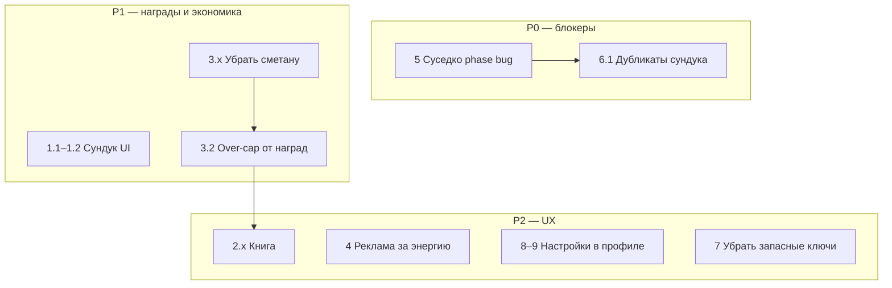

# План итерации исправлений

Источник: [instruction/plans/plan.md](instruction/plans/plan.md)

---

## Epic 1 — Сундук: локализация, экипировка, дубликаты (п. 1, 6)

### 1.1 Локализация названия награды

**Проблема:** в [ChestLootModal.tsx](src/ui/chest/ChestLootModal.tsx) `resolveLootLabel` выводит raw id (`vulkan`, `brownie_standart`) вместо локализованного имени.

**Решение:** для `cat_skin` / `brownie_skin` / `izba_skin` / `window_skin` использовать `resolveSkinName()` из [skinContent.ts](src/data/skinContent.ts) (как уже сделано для титулов через `resolveTitleName`).

### 1.2 Скины не экипируются автоматически

**Проблема:** при открытии сундука [applyChestLoot](src/domain/chestLoot.ts) пишет и в `ownedSkinIds`, и в `patch.skins` — скин сразу надевается.

**Решение:**
- Убрать `patch.skins = …` из `applyChestLoot` для всех skin-наград.
- Экипировка только через `GameStore.equipSkin()` из профиля.
- Проверить [applySpiritReward.ts](src/domain/applySpiritReward.ts) — кейс `izba_skin_harmony` тоже не должен менять активный скин без действия в профиле.
- Награды (энергия, обереги, разблокировка) по-прежнему применяются при открытии сундука; меняется только **авто-экип** скинов/титулов.

### 6.1 Дубликаты скинов → ре-ролл, без утешительных призов

**Проблема:**
- Дефолтные скины (`brownie_standart`, `hut_standart`, `landscape_standart`) не в `ownedSkinIds` при старте → выпадают как «новые».
- При исчерпании пула — `resolveDuplicate()` отдаёт `consolation_energy` / `consolation_obereg`.

**Решение:**
1. В `pickUnowned()` / `buildChestRollState()` учитывать [isDefaultOwnedSkin](src/data/profileCatalog.ts) **или** засеять все дефолты в [createDefaultSave](src/domain/GameSave.ts).
2. Заменить `resolveDuplicate` для скинов/титулов на **цикл ре-ролла** (расширить `MAX_ROLL_ATTEMPTS` в [chestLoot.ts](src/domain/chestLoot.ts)).
3. Убрать `consolation_energy` / `consolation_obereg` из пути дубликатов (план владельца перебивает [loot_tables.md](instruction/dev/loot_tables.md) §duplicates).
4. Аналогично в [miracleChestLoot.ts](src/domain/miracleChestLoot.ts) — дубликат epic-скина не должен давать запасной ключ (см. Epic 2).
5. Тесты: [chestLoot.test.ts](src/domain/chestLoot.test.ts), [GameStore.test.ts](src/store/GameStore.test.ts).

---

## Epic 2 — Убрать запасные ключи (п. 7, решение владельца)

Механика `spareChestKeys` полностью удаляется.

**Затронутые файлы:**
- [GameSave.ts](src/domain/GameSave.ts) — убрать поле; миграция в [saveMigration.ts](src/domain/saveMigration.ts) (игнорировать старое значение).
- [chestLoot.ts](src/domain/chestLoot.ts) — убрать kind `spare_chest_key`, `rollExtraReward`, case в `applyChestLoot`.
- [miracleChestLoot.ts](src/domain/miracleChestLoot.ts) — заменить fallback `spare_chest_key` на ре-ролл / другой допустимый приз.
- [chestCooldown.ts](src/domain/chestCooldown.ts) — убрать ветку `spareChestKeys > 0`.
- [GameStore.ts](src/store/GameStore.ts) — убрать consume key при `openChest`.
- [ChestLootModal.tsx](src/ui/chest/ChestLootModal.tsx), [gameConstants.ts](src/config/gameConstants.ts) — убрать константы и UI.
- [lootTables.ts](src/config/lootTables.ts) — убрать веса `spare_chest_key`.

---

## Epic 3 — Убрать сметану, over-cap энергии (п. 3)

### 3.1 Сметана → прямая энергия

| Было | Станет |
|------|--------|
| `smetana` в сундуке / у Овинника → `smetanaCount++` | **+50 энергии** сразу |
| `smetana_x2` (если появится) | **+100 энергии** |
| HUD-кнопка «использовать сметану» | удалить |
| `useSmetana()` / [smetanaEnergy.ts](src/domain/smetanaEnergy.ts) | удалить или заменить на `addRewardEnergy()` |

**Файлы:** [spirits.ts](src/data/spirits.ts) (reward ovinnik), [chestLoot.ts](src/domain/chestLoot.ts), [miracleChestLoot.ts](src/domain/miracleChestLoot.ts), [lootTables.ts](src/config/lootTables.ts), [GameHud.tsx](src/ui/scene/GameHud.tsx), [dialogContent.ts](src/data/dialogContent.ts), [GameSave.ts](src/domain/GameSave.ts) (убрать `smetanaCount` + миграция).

### 3.2 Over-cap только от наград

Новая функция, например `addRewardEnergy(energy, amount)` — **без** `Math.min(…, maxEnergy)`.

Применить в:
- наградах духов ([applySpiritReward.ts](src/domain/applySpiritReward.ts))
- сундуках (энергия как приз)
- рекламе за энергию (Epic 6)

**Не менять:** [energyRegen.ts](src/domain/energyRegen.ts) — реген по таймеру по-прежнему `Math.min(maxEnergy, …)`.

HUD уже показывает `текущая / макс.` — over-cap отобразится как `150/100`.

---

## Epic 4 — Книга бестиария (п. 2)

### 2.1 Закрытие только по крестику

В [BookOverlay.tsx](src/ui/book/BookOverlay.tsx) убрать `onClick={handleBackdropClick}` с корневого `.book-modal`. Закрытие — только `.book-modal__close`.

### 2.2 Новые иллюстрации в модалке победы

В [QuizModal.tsx](src/ui/quiz/QuizModal.tsx) victory-блок: заменить `spiritPortraitPaths` (чернильные контуры в `creatures_in_the_book/`) на [spiritIllustrationUrl](src/ui/book/spiritIllustrationUrl.ts) (`illustration_book/`). При необходимости подправить `.quiz-result__portrait` в [index.css](src/ui/index.css) (`object-fit: contain`).

### 2.3 Тексты наград в книге

В [spirits.ts](src/data/spirits.ts) обновить `bookRewardDescription`:
- убрать «не выше макс.» у Полевого и других energy-наград;
- Овинник: «+50 энергии» вместо сметаны.

Зависит от Epic 3 (единая формулировка).

---

## Epic 5 — Суседко: монеты не сжигаются (п. 5)

**Root cause:** в [susedkoSteal.ts](src/domain/susedkoSteal.ts) `advanceStealPhase` переходит `idle → warning`, но из `warning` **никогда** не выходит в `stealing` (строка `return phase`).

**Фикс:** добавить ветку `warning → stealing` когда `elapsed >= WARNING + START_DELAY`, либо в [eventUiStore.ts](src/store/eventUiStore.ts) обрабатывать `susedkoPhase === 'warning' && nextPhase === 'stealing'`.

**Дополнительно (по [room_01_layout.md](instruction/room_01_layout.md) §7):**
- `GameHud`: класс `.hud-coins--stealing` при активной фазе кражи.
- FX монет к Суседко каждые 3 с (вызов `spawnCoinFx` из steal-tick).

**Тесты:** unit для `advanceStealPhase` + интеграционный сценарий warning@5s → stealing@10s → coin-1@13s.

---

## Epic 6 — Реклама за энергию при 0 (п. 4)

**Триггер:** клик по коту при `energy === 0` (онбординг завершён) → модалка в стиле [ChestCooldownModal.tsx](src/ui/chest/ChestCooldownModal.tsx).

**Реализация:**
1. Новый `EnergyRewardModal` + store (по образцу `chestUiStore`).
2. `GameStore.restoreEnergyWithRewarded()` — `adsService.showRewarded()` → `+50` через `addRewardEnergy()` (over-cap разрешён).
3. Константа `REWARDED_ENERGY_BONUS = 50` в [gameConstants.ts](src/config/gameConstants.ts).
4. Строки в [dialogContent.ts](src/data/dialogContent.ts).
5. Монтировать в [IzbaScene.tsx](src/ui/scene/IzbaScene.tsx).
6. В [CatAndFxLayers.tsx](src/ui/scene/CatAndFxLayers.tsx) / `clickCat` — открывать модалку вместо silent `none`.

---

## Epic 7 — Настройки в профиле + облако (п. 8, 9)

### 9. Настройки — последняя вкладка профиля

1. Расширить `ProfileTab` в [profileUiStore.ts](src/store/profileUiStore.ts): добавить `'settings'`.
2. В [ProfileModal.tsx](src/ui/profile/ProfileModal.tsx) — 6-я вкладка «Настройки»; рендер [SettingsPanel.tsx](src/ui/SettingsPanel.tsx) без превью/кнопки «Надеть».
3. Убрать `<aside className="izba-scene__settings">` из [IzbaScene.tsx](src/ui/scene/IzbaScene.tsx).
4. Удалить CSS `.izba-scene__settings` из [index.css](src/ui/index.css).

### 8. Облачное сохранение — понятный UI в настройках

- Перенести логику из [CloudBanner.tsx](src/ui/retention/CloudBanner.tsx) в вкладку «Настройки»:
  - поясняющий текст: «Прогресс сохраняется на серверах Яндекс.Игр при входе в аккаунт»;
  - кнопка «Войти через Яндекс» / статус «В облаке».
- Убрать [CloudBanner](src/ui/retention/CloudBanner.tsx) со сцены (или оставить dismiss-only нудж → профиль; предпочтительно убрать дублирование).
- Язык и сброс прогресса остаются в том же `SettingsPanel`.

---

## Порядок работ и зависимости

| # | Epic | Приоритет | Зависимости |
|---|------|-----------|-------------|
| 1 | 5 Суседко | P0 | — |
| 2 | 1+6 Сундук | P0 | Epic 2 (ключи убираются вместе с duplicate-fallback) |
| 3 | 2 Запасные ключи | P1 | вместе с Epic 1 |
| 4 | 3 Сметана + over-cap | P1 | — |
| 5 | 4 Книга | P2 | Epic 3 для текстов 2.3 |
| 6 | 6 Реклама за энергию | P2 | Epic 3 (`addRewardEnergy`) |
| 7 | 7 Настройки + облако | P2 | — |

---

## Критерии приёмки (сводка)

- [ ] Сундук: название скина на выбранном языке; скин разблокирован, но **не надет** до профиля
- [ ] Дубликат скина → автоматический ре-ролл; нет consolation; дефолтные скины не выпадают
- [ ] `spareChestKeys` удалены из кода и сейва
- [ ] Сметана нигде в UI/луте; +50/+100 энергии напрямую
- [ ] Награда может дать 150/100; реген не превышает max
- [ ] Книга закрывается только по ✕; победа в квесте — 3D-иллюстрация; тексты наград без «не выше макс.»
- [ ] Суседко: warning → stealing → монеты −1 каждые 3 с
- [ ] При 0 энергии клик по коту → модалка рекламы +50
- [ ] Настройки (язык, облако, сброс) — последняя вкладка профиля; нет панели справа снизу
- [ ] `npm test` зелёный

---

## Документация (после кода)

Обновить канон по факту: [list_of_spirits.md](instruction/list_of_spirits.md), [loot_tables.md](instruction/dev/loot_tables.md), [scenario.md](instruction/scenario.md) §5.4 (убрать запасной ключ), [tasks.md](instruction/dev/tasks.md) — новые TASK с критериями выше.
